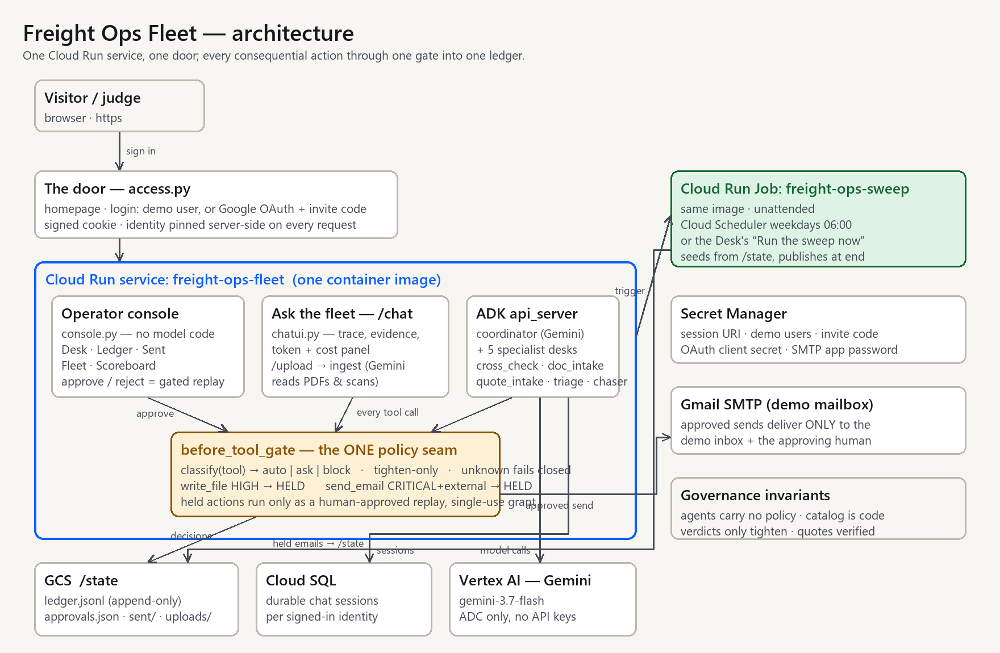

# Architecture



## The shape

```
  operator
     │
     ▼
  coordinator (LlmAgent, Gemini)
     │
     ├── cross_check       AgentTool   Import operations
     ├── doc_intake        AgentTool   Import operations
     ├── quote_intake      AgentTool   Procurement
     ├── tracking_triage   AgentTool   Customer service
     └── doc_chaser        AgentTool   Import operations
              │
              │  EVERY tool call — no exceptions, no second path
              ▼
       before_tool_gate            classify(tool) → auto | ask | block
       (governance/gate.py)        tighten-only · unknown fails closed
          │            │
     auto │            │ ask
          ▼            ▼
     tool body    held → ApprovalStore
          │            │
          │            └── operator grants → replay with approval_id
          │                        │
          └────────────┬───────────┘
                       ▼
          append-only ledger (JSONL)
```

## The deployed shape — one service, one door

```
                     visitor / judge
                          │ https
                          ▼
        ┌─────────────────────────────────────────┐
        │  Cloud Run: freight-ops-fleet (1 image) │
        │                                         │
        │  access.py — homepage · login (demo     │
        │  users, or Google OAuth + invite code)  │
        │  · signed cookie · identity header      │
        │        │                                │
        │        ▼                                │
        │  webapp.py composes:                    │
        │   ├─ console.py  /desk /ledger /sent    │
        │   │   /fleet /evidence  (no model code) │
        │   ├─ chatui.py   /chat  (the one page   │
        │   │   with JS; trace, evidence, usage)  │
        │   ├─ /upload  → ingest (Gemini reads    │
        │   │   the page)                         │
        │   ├─ /sweep/run → Cloud Run Job trigger │
        │   └─ ADK api_server  /run_sse /apps/…   │
        │       coordinator + 5 desks → gate      │
        └───────┬──────────────┬──────────┬───────┘
                │              │          │
                ▼              ▼          ▼
        GCS /state       Cloud SQL     Vertex AI
        ledger.jsonl     sessions      Gemini
        approvals.json   (per          (ADC, no
        sent/ uploads/   identity)     API keys)
                ▲
                │ seeds from state, publishes at end
        Cloud Run Job: freight-ops-sweep
        (Cloud Scheduler weekdays 06:00, or the desk button)
```

## The one idea

**There is exactly one policy seam, and agents carry no policy.**

An agent's catalog card declares which tools it may use. The gate classifies
those tools. Neither the agent nor the tool decides whether a call is allowed —
which means adding an agent cannot add a bypass, and adding a tool without
classifying it fails closed rather than running unattended.

This is the difference between a trust boundary and a confirmation dialog. A
confirmation dialog is code that asks nicely at each call site, and it is only as
good as the call site that remembers to ask.

## Verdict precedence — tighten-only

```
block > ask > auto
```

Verdicts combine through `stricter()` and only through `stricter()`. Every layer
may add friction; no layer may remove it. Concretely:

- `risk >= HIGH` → floor of `ask`
- `external_side_effect` → floor of `ask`, whatever the risk row says
- unknown tool → `block`

A human-approved replay is the *only* thing that converts a held call into a
running one, and it is recorded with the approval id that authorized it.

## Why the ledger is append-only

A record that can be edited is not evidence. There is no update path and no
delete path — the ledger is opened in append mode and read back whole. For the
demo that is JSONL — on disk locally, on a GCS bucket mounted into the one
Cloud Run service in the deployment — and the console serves and verifies the
exact bytes.

## Why AgentTool rather than sub-agent transfer

ADK offers two composition modes. Transfer hands the conversation to the
specialist; `AgentTool` calls it and returns.

This fleet uses `AgentTool` because a real shipment question crosses desks — a
tracking exception raises a document question, a quote comparison feeds a
discrepancy dispute — and the coordinator has to keep the thread to compose them.
Transfer would strand the operator inside whichever specialist answered first.

## What is deliberately absent

- **No multi-tenancy.** One operator, one workspace. The prior system this borrows
  from carries row-level security across tenants; that is the right answer for a
  product and the wrong answer for a 12-day build.
- **No send path the model controls.** `send_email` is wired, CRITICAL and
  external, so the gate holds it on every path; its body delivers only to the
  operator's demo mailbox and the approving human — never to the address the
  model drafted (`tools/mail.py`).
- **No model in the grading path.** See `eval/grader.py`.
- **No policy configuration UI.** The catalog is code-owned on purpose: a
  reviewable diff is a better audit surface than a settings screen.
